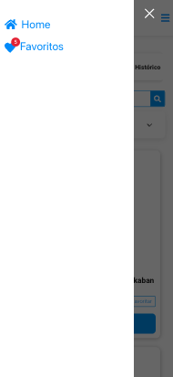

# Google Book


## Front End Technical Challenge

- Create a system to search for books available in the Google Books API

## Functional requirements

- As a user I would like to type some words and see a list of books that are related to my search;
- As a user I would like to click on one of these books to see the book descriptions in detail;

- As a user, I would like to mark the book as a favorite to, in the future, filter them accordingly;

- As a user I must use a pager to access the rest of the results;

- As a user I would like to open the site on a mobile device without compromising site navigation;

- As a developer, I would like to carry out unit tests to ensure the integrity of what is being developed.

## Non-functional requirements

- You must use the React framework;
- Try to reuse as much code as possible;

- For testing use the tool you want, such as: Jasmine, Karma, Mocha;

- Layout can be used in frameworks like Bootstrap, Bulma, Tailwind, etc;

- If you need to use task automation like Gulp, Webpack, etc;

- Make constant commits (git) according to the progression of activities.

## Related links

- Google Books API - https://developers.google.com/books/

- React - https://reactjs.org/

- Jasmine - https://jasmine.github.io/

- Mocha - https://mochajs.org/

- Gulp - https://gulpjs.com/

- Webpack - https://webpack.js.org/

- GitHub - https://github.com/

## Installation

To be able to start this project, it is necessary to install the dependencies
### `cd frontend && npm install --legacy-peer-deps`

## Run project

### `npm start`

Runs the app in the development mode.\
Open [http://localhost:3000](http://localhost:3000) to view it in the browser.

## Tests
### `npm test`

Launches the test runner in the interactive watch mode.

#### Test if title is equal mock:

```react
describe('Book component testing', function() {
  it('Test if title is equal mock', async function() {
    process.env.REACT_APP_BOOKS_API_URL = 'https://www.googleapis.com/books';

    const book: BookModel = {
        id: 'ZDgQCwAAQBAJ',
        volumeInfo: {
            title: 'Harry Potter e o Cálice de Fogo',
            authors: ["J.K. Rowling"],
            publisher: "Pottermore Publishing",
            publishedDate: "2015-12-08",
            description: "<p>Haverá três tarefas, espaçadas durante o ano letivo, que servirão para testar os campeões de diferentes maneiras... sua perícia em magia, sua coragem, seus poderes de dedução e, naturalmente, sua capacidade de enfrentar o perigo.'<br><br>O Torneio Tribruxo será realizado em Hogwarts. Apenas bruxos acima dos dezessete anos de idade podem se inscrever - mas isso não impede que Harry sonhe em vencer a competição. E então, no Dia das Bruxas, quando o Cálice de Fogo faz sua seleção, Harry se surpreende ao ver que seu nome é um dos que a taça mágica escolhe. Ele terá de enfrentar tarefas mortais, dragões e bruxos das trevas, mas com a ajuda de seus melhores amigos, Ron e Hermione, talvez ele consiga sair dessa - vivo!</p>",
            industryIdentifiers: [{
                "type": "ISBN_10",
                "identifier": "1781103712"
            },
            {
                "type": "ISBN_13",
                "identifier": "9781781103715"
            }],
            pageCount: 535,
            printType: 'BOOK',
            categories: [
                "Juvenile Fiction / Action & Adventure / General",
                "Fiction / Action & Adventure",
                "Fiction / Fantasy / Contemporary",
                "Juvenile Fiction / Fantasy & Magic",
                "Young Adult Fiction / Action & Adventure / General",
                "Young Adult Fiction / Fantasy / Wizards & Witches",
                "Young Adult Fiction / School & Education / Boarding School & Prep School",
                "Fiction / Fantasy / General",
                "Juvenile Fiction / School & Education"
            ],
            averageRating: 4.5,
            ratingsCount: 220,
            imageLinks: {
                thumbnail: "http://books.google.com/books/publisher/content?id=ZDgQCwAAQBAJ&printsec=frontcover&img=1&zoom=1&edge=curl&imgtk=AFLRE735R3dGj5rFfpqqWj16EvJSXKG3PFpNCfLZvp8iszL9LcPtKpN0lEF_A1n6D02HWtYpjMEIgtJtuptxvtjMYb9KowCz-3IOSE3LR0mHgxRzZZckZL8dPnR5-OEePyuDZ3Xft72K&source=gbs_api",
            },
            language: 'pt-BR',
            previewLink: "http://books.google.com.br/books?id=ZDgQCwAAQBAJ&hl=&source=gbs_api",
        },
        saleInfo: {
            country: 'BR',
            saleability: 'FOR_SALE',
            isEbook: false,
            listPrice: {
                amount: 24.9,
                currencyCode: "BRL"
            },
            buyLink: "https://play.google.com/store/books/details?id=ZDgQCwAAQBAJ&rdid=book-ZDgQCwAAQBAJ&rdot=1&source=gbs_api",
        },
        accessInfo: {
            pdf: {
                isAvailable: true,
                acsTokenLink: "http://books.google.com.br/books/download/Harry_Potter_e_o_C%C3%A1lice_de_Fogo-sample-pdf.acsm?id=ZDgQCwAAQBAJ&format=pdf&output=acs4_fulfillment_token&dl_type=sample&source=gbs_api"
            }
        }
    }

    const bookId = book.id;
    var mock = new MockAdapter(axios);
    mock.onGet(`${process.env.REACT_APP_BOOKS_API_URL}/v1/volumes/${bookId}`).reply(200, book);

    render(
        <Provider store={store}>
            <BrowserRouter>
                <BookComponent 
                    book={book} />
            </BrowserRouter>
        </Provider>
    );
           
    expect(screen.getByTestId('book-component-title')).toHaveTextContent('Harry Potter e o Cálice de Fogo');
  });
});
```


## Screens

### Home

You can search by:

- Query
- Subject
- It is downloadable
- Book Type (Free Books, Paid Books, Digital Books)
- Number of books per search
- File type (Book, Magazine)
- Language
- Sort results (Relevance, Newest)

#### Desktop:

The Header has the site logo and two buttons (Home, Favorites)


#### Mobile:


##### Filter:


##### Header Aside:



### Book page

On each book's detail page, you can see:
• The title
• The book cover
• The authors
• The Publisher
• Publication date
• Number of pages
• Description
• Language of the book
• Book categories
• Price and link to purchase the book (if available)
• Button to download PDF of the book (if available)
• Recommended books related to the chosen book category

#### Desktop:


#### Mobile:


### Favorites

In the favorites screen, all the books that the user has marked as favorites appear and it is also possible to choose the number of books per page

#### Desktop:


#### Mobile:


